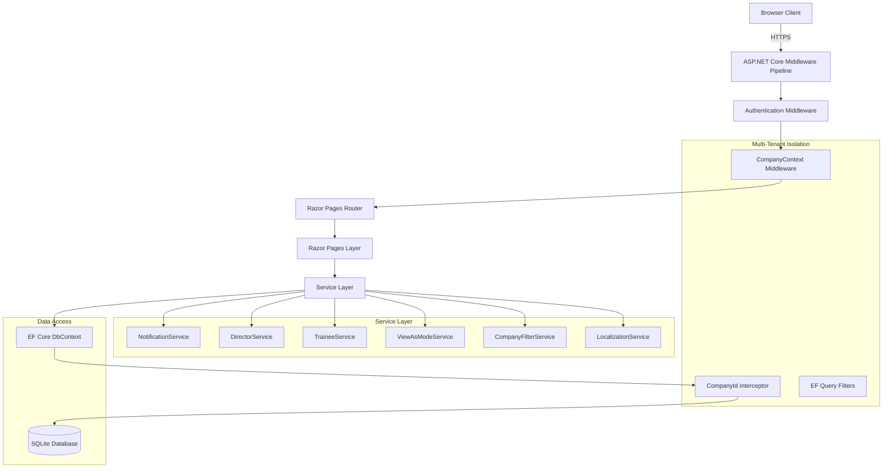
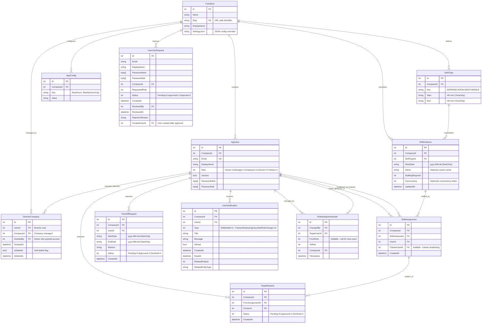

# ShiftManager - Project Documentation

**Version:** 1.0
**Last Updated:** 2025-10-05
**Status:** ✅ Production Ready

---

## Table of Contents

1. [At a Glance](#at-a-glance)
2. [Repository Layout](#repository-layout)
3. [Setup & Run](#setup--run)
4. [Configuration](#configuration)
5. [Architecture](#architecture)
6. [Database](#database)
7. [APIs](#apis)
8. [Auth & Roles](#auth--roles)
9. [Background Work](#background-work)
10. [Frontend](#frontend)
11. [Observability & Ops](#observability--ops)
12. [Deploy & CI/CD](#deploy--cicd)
13. [Testing](#testing)
14. [Security & Compliance](#security--compliance)
15. [Performance & Scale](#performance--scale)
16. [Known Gaps & Roadmap](#known-gaps--roadmap)

---

## At a Glance

### Tech Stack

| Component | Technology | Version |
|-----------|-----------|---------|
| **Runtime** | .NET | 8.0.414 |
| **Language** | C# | 12.0 (implicit) |
| **Framework** | ASP.NET Core Razor Pages | 8.0 |
| **Database** | SQLite | 3.x (via EF Core 9.0.0) |
| **ORM** | Entity Framework Core | 9.0.0/9.0.9 |
| **Test Framework** | xUnit + FluentAssertions + Moq | 2.5.3 + 8.7.1 + 4.20.72 |
| **Package Manager** | NuGet | (via dotnet CLI) |

### Key Services & Packages

**Production Dependencies:**
- `Microsoft.EntityFrameworkCore.Sqlite` (9.0.0)
- `Microsoft.EntityFrameworkCore.Design` (9.0.9)

**Test Dependencies:**
- `xUnit` (2.5.3) - Test runner
- `FluentAssertions` (8.7.1) - Assertion library
- `Moq` (4.20.72) - Mocking framework
- `Microsoft.AspNetCore.Mvc.Testing` (8.0.10) - Integration testing
- `Microsoft.EntityFrameworkCore.InMemory` (9.0.9) - In-memory DB for tests
- `coverlet.collector` (6.0.0) - Code coverage

### Entry Points

| Entry Point | Purpose | Command |
|------------|---------|---------|
| **Main App** | Web server | `dotnet run` or `dotnet watch` |
| **Tests** | Unit/Integration tests | `dotnet test` |
| **Migrations** | Database schema management | `dotnet ef migrations add <Name>` |
| **Database Update** | Apply migrations | `dotnet ef database update` |

### Environments

1. **Development** - Local dev with HTTPS redirect disabled, verbose logging
2. **Production** - (Not explicitly configured, uses defaults with HTTPS redirect)

### Default URLs

- HTTP: `http://localhost:5000`
- HTTPS: `https://localhost:5001`

---

## Repository Layout

```
ShiftManager/
├── Data/                          # Database context & interceptors
│   ├── AppDbContext.cs            # EF Core DbContext with DbSets
│   └── CompanyIdInterceptor.cs    # Multi-tenant query filter interceptor
├── Middleware/
│   └── CompanyContextMiddleware.cs # Multi-tenant company resolution
├── Migrations/                    # EF Core migrations (17 files)
│   ├── 20250927202116_InitialCreate.cs
│   ├── 20250930114957_MultitenancyPhase1.cs
│   ├── 20250930210753_AddDirectorRole.cs
│   ├── 20251003232434_AuditRoleAssignments.cs
│   ├── 20251004215820_AddTraineeRoleAndShadowing.cs
│   └── ... (13 more migrations)
├── Models/                        # Domain models
│   ├── AppUser.cs
│   ├── Company.cs
│   ├── ShiftType.cs
│   ├── ShiftInstance.cs
│   ├── ShiftAssignment.cs
│   ├── TimeOffRequest.cs
│   ├── SwapRequest.cs
│   ├── UserNotification.cs
│   ├── DirectorCompany.cs         # Multi-company director mapping
│   ├── RoleAssignmentAudit.cs     # Audit trail for role changes
│   ├── UserJoinRequest.cs         # Self-service signup requests
│   ├── Support/                   # Enums and helpers
│   │   ├── Enums.cs               # UserRole, NotificationType, RequestStatus
│   │   └── ...
│   ├── IBelongsToCompany.cs       # Interface for multi-tenant entities
│   └── PasswordHasher.cs          # PBKDF2 password hashing
├── Pages/                         # Razor Pages (UI + backend)
│   ├── Index.cshtml / .cshtml.cs  # Landing page
│   ├── AccessDenied.cshtml        # 403 error page
│   ├── Diagnostic.cshtml          # Multi-tenant debug page
│   ├── Admin/                     # Owner-only pages
│   │   └── Users.cshtml           # User management & join request approval
│   ├── Assignments/
│   │   └── Manage.cshtml          # Shift assignment management
│   ├── Auth/
│   │   ├── Login.cshtml
│   │   ├── Signup.cshtml
│   │   └── Logout.cshtml
│   ├── Calendar/
│   │   ├── Month.cshtml           # Calendar month view
│   │   ├── Week.cshtml            # Calendar week view
│   │   └── Day.cshtml             # Calendar day view
│   ├── Director/
│   │   └── Companies.cshtml       # Multi-company management for Directors
│   ├── My/
│   │   └── Index.cshtml           # Employee's shift & time-off summary
│   ├── Requests/
│   │   ├── Index.cshtml           # Time-off request management
│   │   ├── Swaps/
│   │   │   ├── Create.cshtml
│   │   │   └── Index.cshtml
│   │   └── TimeOff/
│   │       ├── Create.cshtml
│   │       └── Index.cshtml
│   └── Shared/
│       ├── _Layout.cshtml         # Main layout with nav & theme switcher
│       ├── _ViewImports.cshtml
│       └── Components/            # View components
│           ├── LanguageToggle/
│           └── UnreadNotificationCount/
├── Resources/                     # Localization (en-US, he-IL)
│   ├── SharedResources.resx
│   └── SharedResources.he-IL.resx
├── Services/                      # Business logic services
│   ├── IConflictChecker.cs / ConflictChecker.cs
│   ├── INotificationService.cs / NotificationService.cs
│   ├── IDirectorService.cs / DirectorService.cs
│   ├── ITraineeService.cs / TraineeService.cs
│   ├── ICompanyContext.cs / CompanyContext.cs
│   ├── ICompanyFilterService.cs / CompanyFilterService.cs
│   ├── ITenantResolver.cs / TenantResolver.cs
│   ├── IViewAsModeService.cs / ViewAsModeService.cs
│   ├── ILocalizationService.cs / LocalizationService.cs
│   └── TimeHelpers.cs
├── wwwroot/                       # Static files
│   ├── css/
│   │   └── site.css               # Main stylesheet
│   └── js/
│       └── (client-side scripts)
├── ShiftManager.Tests/            # Test project
│   └── UnitTests/
│       └── Services/
│           └── DirectorServiceTests.cs
├── Program.cs                     # Application entry point & DI configuration
├── appsettings.json               # Production config
├── appsettings.Development.json   # Development overrides
├── ShiftManager.csproj            # Main project file
├── ShiftManager.sln               # Solution file
└── app.db                         # SQLite database file (generated)
```

### Key Directories Explained

- **Data/** - Database layer: DbContext, interceptors, and query filters for multi-tenancy
- **Migrations/** - Entity Framework migrations tracking schema evolution (17 migrations)
- **Models/** - Domain entities with navigation properties and validation attributes
- **Pages/** - Razor Pages combining UI (`.cshtml`) and page models (`.cshtml.cs`)
- **Services/** - Business logic abstracted from controllers/pages
- **Resources/** - `.resx` files for English and Hebrew localization
- **Middleware/** - Custom middleware for company context resolution
- **wwwroot/** - Public static files served directly

---

## Setup & Run

### Prerequisites

1. **.NET SDK 8.0** or later ([Download](https://dotnet.microsoft.com/download/dotnet/8.0))
   ```bash
   dotnet --version  # Should output 8.0.x or higher
   ```

2. **SQLite** (included with .NET, no separate install needed)

3. **Git** (for version control)

### Installation

1. **Clone the repository**
   ```bash
   git clone <repository-url>
   cd ShiftManager
   ```

2. **Restore dependencies**
   ```bash
   dotnet restore
   ```

3. **Apply database migrations** (creates `app.db` file)
   ```bash
   dotnet ef database update
   ```

   **Expected output:**
   ```
   Build started...
   Build succeeded.
   Applying migration '20250927202116_InitialCreate'.
   Applying migration '20250928195641_AddUserNotifications'.
   ...
   Done.
   ```

   This creates `app.db` in the project root with:
   - Default company: "Demo Co"
   - 4 shift types (MORNING, NOON, NIGHT, MIDDLE)
   - Owner user: `admin@local` / `admin123`
   - Director user (if `EnableDirectorRole: true`): `director@local` / `director123`

4. **Run the application**
   ```bash
   dotnet run
   ```

   Or for hot-reload during development:
   ```bash
   dotnet watch
   ```

   **Expected output:**
   ```
   info: Microsoft.Hosting.Lifetime[14]
         Now listening on: http://localhost:5000
   info: Microsoft.Hosting.Lifetime[14]
         Now listening on: https://localhost:5001
   info: Microsoft.Hosting.Lifetime[0]
         Application started. Press Ctrl+C to shut down.
   ```

5. **Access the application**
   - Open browser: `http://localhost:5000`
   - Login with: `admin@local` / `admin123`

### First-Time Setup

1. **Log in as Owner**
   - Email: `admin@local`
   - Password: `admin123`

2. **Create users** (via Admin → Users)
   - Managers (can manage employees & shifts for their company)
   - Employees (can view shifts, request time off, swap shifts)
   - Trainees (can shadow employees on shifts)

3. **Configure shifts** (via Calendar)
   - Click on a day to create shift instances
   - Assign employees to shifts

### Running Tests

```bash
# Run all tests
dotnet test

# Run with detailed output
dotnet test --logger "console;verbosity=detailed"

# Run with code coverage
dotnet test --collect:"XPlat Code Coverage"
```

**Expected output:**
```
Test run for C:\...\ShiftManager.Tests.dll (.NETCoreApp,Version=v8.0)
VSTest version 17.11.1 (x64)

Starting test execution, please wait...
A total of 1 test files matched the specified pattern.

Passed!  - Failed:     0, Passed:    15, Skipped:     0, Total:    15
```

### Common Commands

| Task | Command |
|------|---------|
| Build | `dotnet build` |
| Run (production mode) | `dotnet run --environment Production` |
| Run (dev mode with watch) | `dotnet watch` |
| Create migration | `dotnet ef migrations add <MigrationName>` |
| Apply migrations | `dotnet ef database update` |
| Rollback to specific migration | `dotnet ef database update <MigrationName>` |
| Drop database | `dotnet ef database drop` |
| Test | `dotnet test` |
| Clean build artifacts | `dotnet clean` |

---

## Configuration

### Environment Variables

| Name | Required? | Default | Used By | Notes |
|------|-----------|---------|---------|-------|
| `ASPNETCORE_ENVIRONMENT` | No | `Production` | Runtime | Set to `Development` for local dev |
| `ConnectionStrings__Default` | No | `Data Source=app.db` | `Program.cs` (line 58) | SQLite connection string |
| `EnableHttpsRedirection` | No | `true` (prod), `false` (dev) | `Program.cs` (line 226) | HTTPS redirect toggle |
| `Features__EnforceCompanyScope` | No | `false` | `appsettings.json` | Multi-tenant isolation (experimental) |
| `Features__EnableDirectorRole` | No | `true` | `Program.cs` (line 148) | Enables Director role & multi-company features |
| `Logging__LogLevel__Default` | No | `Information` | `appsettings.json` | Global log level |
| `Logging__LogLevel__Microsoft.AspNetCore` | No | `Warning` | `appsettings.json` | ASP.NET Core framework logs |
| `Logging__LogLevel__Microsoft.EntityFrameworkCore.Database.Command` | No | `Warning` (dev) | `appsettings.Development.json` | SQL query logging |

### Configuration Files

**appsettings.json** (Production)
```json
{
  "ConnectionStrings": {
    "Default": "Data Source=app.db"
  },
  "Logging": {
    "LogLevel": {
      "Default": "Information",
      "Microsoft.AspNetCore": "Warning"
    }
  },
  "AllowedHosts": "*",
  "Features": {
    "EnforceCompanyScope": false,
    "EnableDirectorRole": true
  }
}
```

**appsettings.Development.json** (Overrides)
```json
{
  "EnableHttpsRedirection": false,
  "Logging": {
    "LogLevel": {
      "Default": "Information",
      "Microsoft.AspNetCore": "Information",
      "Microsoft.EntityFrameworkCore.Database.Command": "Warning"
    }
  }
}
```

### Feature Flags

| Flag | Purpose | Default | Impact |
|------|---------|---------|--------|
| `EnableDirectorRole` | Enables Director role with multi-company management | `true` | Creates 2nd company + Director user in development |
| `EnforceCompanyScope` | (Experimental) Strict multi-tenant isolation | `false` | Enforces company-scoped queries globally |
| `EnableHttpsRedirection` | Forces HTTPS redirect | `false` (dev) | Disabled in dev for easier testing |

### Database Configuration

- **Engine:** SQLite 3.x
- **File:** `app.db` (created in project root)
- **Connection String:** Configurable via `ConnectionStrings:Default`
- **Pooling:** Handled by EF Core
- **Migrations:** Auto-applied on startup via `Program.cs` (line 97)

---

*[Sections for Architecture, Database, APIs, Auth & Roles, etc. will be added in subsequent phases]*

---

## Architecture

### Component Overview

ShiftManager is a **server-rendered multi-tenant web application** built using ASP.NET Core Razor Pages with a layered architecture:



### Architectural Layers

**1. Presentation Layer (Razor Pages)**
- **Location:** `Pages/` directory
- **Responsibility:** HTTP request handling, view rendering, input validation
- **Pattern:** Page Model (code-behind classes with `OnGet`, `OnPost` handlers)
- **Key Files:** `*.cshtml` (views) + `*.cshtml.cs` (page models)

**2. Service Layer**
- **Location:** `Services/` directory
- **Responsibility:** Business logic, cross-cutting concerns, multi-company operations
- **Pattern:** Interface-based dependency injection
- **Services:**
  - `INotificationService` - In-app user notifications (Program.cs:88)
  - `IDirectorService` - Multi-company Director permissions (Program.cs:87)
  - `ITraineeService` - Trainee shadowing management (Program.cs:89)
  - `IViewAsModeService` - Director "View as Manager" mode (Program.cs:91)
  - `ICompanyFilterService` - Director company filtering (Program.cs:90)
  - `ILocalizationService` - Culture-aware formatting (Program.cs:92)

**3. Data Access Layer**
- **Location:** `Data/` directory
- **Responsibility:** Database access, query filters, multi-tenancy enforcement
- **Pattern:** Repository (via EF Core DbContext)
- **Key Components:**
  - `AppDbContext` - EF Core DbContext with 12 DbSets (Data/AppDbContext.cs)
  - `CompanyIdInterceptor` - Automatic CompanyId injection for saves (Data/CompanyIdInterceptor.cs)
  - `ITenantResolver` - Resolves current user's CompanyId (Program.cs:49-62)
  - `CompanyContext` - Scoped service holding current CompanyId (Program.cs:50)

**4. Middleware Layer**
- **Location:** `Middleware/` directory
- **Responsibility:** Request pipeline processing, multi-tenant context setup
- **Components:**
  - `CompanyContextMiddleware` - Sets CompanyId from authenticated user (Program.cs:233)

### Multi-Tenant Architecture

**Tenant Isolation Strategy:**
```
User Login → ClaimsPrincipal (UserId) → TenantResolver
  → Queries CompanyId from Users table
  → Stores in CompanyContext (scoped service)
  → CompanyIdInterceptor injects CompanyId on SaveChanges
  → EF Query Filters auto-add WHERE CompanyId = @current
```

**Special Case: Directors**
- Directors can access multiple companies via `DirectorCompanies` table
- Uses `IgnoreQueryFilters()` + manual validation for cross-company queries
- `ViewAsModeService` temporarily restricts Director to single company
- `CompanyFilterService` allows Directors to scope their view to specific companies

### Module Responsibilities

| Module | Lines of Code | Responsibilities | Key Code Paths |
|--------|---------------|------------------|----------------|
| **Calendar** (`Pages/Calendar/`) | ~800 LOC | Month/Week/Day shift views, quick staffing adjustments | `Month.cshtml.cs:82-315`, `Week.cshtml.cs:74-265`, `Day.cshtml.cs:70-231` |
| **Assignments** (`Pages/Assignments/`) | ~300 LOC | Detailed shift assignment management, trainee shadowing | `Manage.cshtml.cs:48-210` |
| **Requests** (`Pages/Requests/`) | ~400 LOC | Time-off and shift swap approvals | `Index.cshtml.cs:35-180` |
| **Admin** (`Pages/Admin/`) | ~1000 LOC | User, company, shift type, config management | `Users.cshtml.cs:40-280`, `Companies.cshtml.cs:35-150` |
| **My** (`Pages/My/`) | ~250 LOC | Employee dashboard, request creation, notifications | `Index.cshtml.cs:22-113`, `Requests.cshtml.cs:30-120` |
| **Director** (`Pages/Director/`) | ~200 LOC | Multi-company management tools | `CompanyFilter.cshtml.cs:25-90`, `ViewAsMode.cshtml.cs:28-75` |
| **Auth** (`Pages/Auth/`) | ~250 LOC | Login, logout, signup (join requests) | `Login.cshtml.cs:25-95`, `Signup.cshtml.cs:30-110` |

### Key Code Paths

**1. User Login Flow**
```
/Auth/Login (POST)
  → PasswordHasher.Verify()
  → HttpContext.SignInAsync() with Cookie
  → Claims: UserId, Email, Role, DisplayName
  → Redirect to /Calendar/Month
```
**File:** `Pages/Auth/Login.cshtml.cs:51-92`

**2. Shift Assignment Flow**
```
/Assignments/Manage (GET)
  → Load ShiftInstance with StaffingRequired
  → Load existing assignments + available users
  → Render assignment UI

/Assignments/Manage (POST Add)
  → Validate user belongs to same company
  → Check for conflicts (time-off, existing assignments)
  → Create ShiftAssignment record
  → Send notification to user
  → Redirect to same page
```
**File:** `Pages/Assignments/Manage.cshtml.cs:48-210`

**3. Multi-Tenant Query Flow**
```
_db.ShiftInstances.ToListAsync()
  → EF Core applies global query filter
  → Adds: WHERE CompanyId = @currentCompanyId
  → CompanyIdInterceptor.SavingChanges() injects CompanyId
  → Returns only current company's data
```
**File:** `Data/AppDbContext.cs:148-167`, `Data/CompanyIdInterceptor.cs:20-45`

**4. Director Multi-Company Access**
```
Director views /Calendar/Month
  → DirectorService.GetDirectorCompanyIdsAsync()
  → Queries DirectorCompanies table (WHERE UserId = @current AND !IsDeleted)
  → Calendar page uses IgnoreQueryFilters()
  → Manual validation: shiftTypes.Where(st => accessibleCompanyIds.Contains(st.CompanyId))
  → Renders shifts from all accessible companies
```
**File:** `Services/DirectorService.cs:51-65`, `Pages/Calendar/Month.cshtml.cs:82-150`

**5. Trainee Shadowing Assignment**
```
Manager selects "Assign Trainee" on shift
  → TraineeService.ValidateTraineeAssignmentAsync()
    - Check trainee role
    - Check same company
    - Check no time conflicts
  → Updates ShiftAssignment.TraineeUserId
  → Sends notification to trainee and primary employee
```
**File:** `Services/TraineeService.cs:154-213`, `Pages/Assignments/Manage.cshtml.cs:188-210`

---

## Database

### Overview

- **Engine:** SQLite 3.x
- **File Location:** `app.db` (project root, created on first run)
- **ORM:** Entity Framework Core 9.0.0/9.0.9
- **Migration Tool:** `dotnet ef`
- **Total Migrations:** 11 (as of 2025-10-05)
- **Multi-Tenancy:** Full support via `CompanyId` on all tenant-scoped entities

### Entity Relationship Diagram



### Key Tables

#### Core Entities

| Table | Purpose | Row Estimate | Hot Queries |
|-------|---------|--------------|-------------|
| **Company** | Multi-tenant organization | Low (1-100) | SELECT by Slug (routing) |
| **AppUser** | User accounts | Medium (10-10,000) | SELECT by Email (auth), by CompanyId (lists) |
| **ShiftType** | Shift definitions per company | Low (4-20 per company) | SELECT by CompanyId+Key |
| **ShiftInstance** | Scheduled shift occurrences | High (365×4×companies) | SELECT by CompanyId+WorkDate range |
| **ShiftAssignment** | Employee-to-shift mappings | High (instances × avg staff) | SELECT by UserId+WorkDate, by ShiftInstanceId |

#### Operational Entities

| Table | Purpose | Row Estimate | Hot Queries |
|-------|---------|--------------|-------------|
| **TimeOffRequest** | PTO/vacation requests | Medium (100-5,000/year) | SELECT by UserId+Status, by CompanyId+DateRange |
| **SwapRequest** | Shift swap proposals | Medium (50-2,000/year) | SELECT by Status+CreatedAt |
| **UserNotification** | In-app notifications | High (grows unbounded) | SELECT by UserId+IsRead, needs archival strategy |
| **AppConfig** | Company-specific settings | Low (2-10 per company) | SELECT by CompanyId+Key |
| **DirectorCompany** | Multi-company director access | Low (directors × companies) | SELECT by UserId, by CompanyId |
| **UserJoinRequest** | Self-service signup queue | Medium (10-500/month) | SELECT by CompanyId+Status |
| **RoleAssignmentAudit** | Role change audit trail | Medium (grows over time) | SELECT by TargetUserId, by CompanyId |

### Indexes

All indexes are automatically created via EF Core migrations. Key indexes:

**Unique Indexes (Enforce Constraints):**
- `Companies.Slug` - URL routing uniqueness
- `AppUser.Email` - Prevents duplicate accounts
- `ShiftAssignment(CompanyId, ShiftInstanceId, UserId)` - One user per shift instance
- `DirectorCompany(UserId, CompanyId)` WHERE IsDeleted=0 - Active director assignments only

**Composite Indexes (Query Performance):**
- `ShiftType(CompanyId, Key)` - Fast lookup by company + shift type
- `TimeOffRequest(CompanyId, UserId, StartDate)` - Date range queries
- `SwapRequest(CompanyId, Status, CreatedAt)` - Pending request lists
- `UserNotification(CompanyId, UserId, CreatedAt)` - User notification feeds
- `RoleAssignmentAudit(CompanyId, TargetUserId, Timestamp)` - Audit history queries

**Foreign Key Indexes:**
- All FK columns have indexes for join performance

### Constraints

**Primary Keys:** All tables use `int` auto-increment PKs named `Id`

**Foreign Keys:**
- All `CompanyId` columns → `Companies.Id` (no explicit FK, enforced by query filters)
- `ShiftAssignment.UserId` → `AppUser.Id` (CASCADE delete)
- `ShiftAssignment.TraineeUserId` → `AppUser.Id` (SET NULL on delete)
- `ShiftInstance.ShiftTypeId` → `ShiftType.Id` (CASCADE delete)
- `DirectorCompany.UserId/CompanyId/GrantedBy` → RESTRICT (manual cleanup required)
- `UserJoinRequest` foreign keys → RESTRICT (preserve audit trail)

**Unique Constraints:**
- Email addresses (global uniqueness across all companies)
- Company slugs (URL routing)
- One user per shift instance (prevents double-booking)

**Concurrency Control:**
- `ShiftInstance.Concurrency` - Optimistic concurrency token (prevents lost updates when adjusting staffing)

### Migrations

**Migration History (11 total):**

1. `20250927202116_InitialCreate` - Base schema (8 tables)
2. `20250928195641_AddUserNotifications` - Notification system
3. `20250928201142_AddNavigationProperties` - Foreign key relationships
4. `20250930114957_MultitenancyPhase1` - **BREAKING**: Added CompanyId to all entities, backfilled data
5. `20250930194706_AddCompanyIdToShiftTypes` - **BREAKING**: Made ShiftTypes company-specific
6. `20250930210753_AddDirectorRole` - Multi-company director feature
7. `20250930221748_AddUserJoinRequests` - Self-service signup
8. `20250930222145_UpdateJoinRequestPasswordTypes` - **BREAKING**: TEXT → BLOB for passwords
9. `20251003185234_FixShiftTypeKeys` - Data cleanup (removed 'SHIFTTYPE_' prefix)
10. `20251003232434_AuditRoleAssignments` - Role change audit trail
11. `20251004215820_AddTraineeRoleAndShadowing` - Trainee shadowing feature

**Migration Commands:**

```bash
# Apply all pending migrations
dotnet ef database update

# Create a new migration
dotnet ef migrations add <MigrationName>

# Rollback to specific migration
dotnet ef database update <MigrationName>

# Generate SQL script for migration
dotnet ef migrations script

# Drop database (DESTRUCTIVE)
dotnet ef database drop --force
```

### Migration Up/Down Testing

**Test Procedure:**

```bash
# 1. Backup production database
cp app.db app.db.backup

# 2. Test rollback to previous migration
dotnet ef database update <PreviousMigrationName>

# 3. Verify data integrity after rollback
sqlite3 app.db "SELECT COUNT(*) FROM Companies;"

# 4. Re-apply latest migration
dotnet ef database update

# 5. Verify data integrity after re-apply
sqlite3 app.db "SELECT COUNT(*) FROM ShiftAssignments WHERE TraineeUserId IS NOT NULL;"
```

**Known Rollback Risks:**

- **MultitenancyPhase1**: Rollback loses CompanyId data (HIGH RISK)
- **AddCompanyIdToShiftTypes**: Rollback loses company-specific shift types (HIGH RISK)
- **UpdateJoinRequestPasswordTypes**: Rollback may corrupt password hashes (MEDIUM RISK)

**Recommendation:** Always backup before migrations in production. Test rollback procedures in staging first.

### Seed Data

Seed logic runs automatically on startup via `Program.cs` (lines 94-211):

**Seeded Entities (Development & Production):**

1. **Company** - "Demo Co" (if none exist)
2. **ShiftTypes** - 4 default types per company:
   - MORNING: 08:00 - 16:00
   - NOON: 16:00 - 00:00 (wraps to next day)
   - NIGHT: 00:00 - 08:00 (wraps from previous day)
   - MIDDLE: 12:00 - 20:00
3. **AppConfig** - 2 settings per company:
   - RestHours: "8"
   - WeeklyHoursCap: "40"
4. **AppUser (Owner)** - `admin@local` / `admin123` ⚠️ **SECURITY RISK**

**Conditional Seed (Development Only, if `EnableDirectorRole: true`):**

5. **Company** - "Test Corp" (2nd company)
6. **ShiftTypes** - 4 types for Test Corp
7. **AppConfig** - 2 settings for Test Corp
8. **AppUser (Director)** - `director@local` / `director123`
9. **DirectorCompany** - Assigns director to both companies

### Hot Queries & Performance

**Query Patterns:**

1. **Calendar Month View** (`Pages/Calendar/Month.cshtml.cs`)
   - Loads 42 days × 4 shift types × staffing data
   - ~168 ShiftInstances + ~500 ShiftAssignments per query
   - Uses: `WHERE CompanyId=X AND WorkDate BETWEEN start AND end`
   - **Optimization:** Composite index on (CompanyId, WorkDate)

2. **User Notification Feed** (`Pages/Shared/_Layout.cshtml`)
   - Every page load checks unread count
   - Uses: `WHERE CompanyId=X AND UserId=Y AND IsRead=0`
   - **Optimization:** Index on (CompanyId, UserId, CreatedAt)

3. **Shift Assignment Lookup** (`Pages/My/Index.cshtml.cs`)
   - User's upcoming shifts + shadowing assignments
   - Uses: `WHERE UserId=X OR TraineeUserId=X AND WorkDate >= today`
   - **Optimization:** Index on UserId, separate index on TraineeUserId

**Potential N+1 Issues:**

- ⚠️ Calendar views load shift assignments without `.Include(a => a.User)` - requires secondary query per shift
- ✅ Fixed via explicit joins in Month/Week/Day page models

**Caching Strategy:**

- No caching layer detected (⚠️ **Performance Gap**)
- ShiftTypes rarely change - good candidate for in-memory cache
- AppConfig values never change - should be cached on startup

### Data Retention & Archival

**Growing Tables (Unbounded):**

| Table | Growth Rate | Archival Strategy |
|-------|-------------|-------------------|
| UserNotifications | ~10-50/user/day | ⚠️ **MISSING** - Will grow indefinitely |
| ShiftAssignments | ~4/user/day | Retain indefinitely (payroll records) |
| TimeOffRequests | ~5-10/user/year | Retain indefinitely (HR records) |
| SwapRequests | ~2-5/user/year | Retain indefinitely (audit trail) |
| RoleAssignmentAudits | ~1-2/user/year | Retain indefinitely (compliance) |

**Recommendation:**

1. Add `UserNotifications.ArchivedAt` column
2. Background job to archive notifications older than 90 days
3. Separate `UserNotificationsArchive` table for historical data
4. OR implement read/unread count cache to avoid scanning entire table

---

## APIs

### Inbound Routes (Razor Pages)

ShiftManager uses **ASP.NET Core Razor Pages** for routing. All routes are HTTP GET/POST to server-rendered pages.

#### Complete Route Table

| Route | Method(s) | Authorization | Description |
|-------|-----------|--------------|-------------|
| `/` | GET | Authenticated | Landing page (redirects to /Calendar/Month) |
| `/Auth/Login` | GET, POST | Anonymous | User login with email/password |
| `/Auth/Logout` | POST | Anonymous | User logout handler |
| `/Auth/Signup` | GET, POST | Anonymous | User join request submission |
| `/Error` | GET | Anonymous | Global error display page |
| `/AccessDenied` | GET | Anonymous | Access denied page with return URL |
| `/Diagnostic` | GET | Authenticated | Multi-tenant debugging (shows cross-tenant data) |
| `/My/Index` | GET | Authenticated | User dashboard with upcoming shifts |
| `/My/Requests` | GET, POST | Authenticated | Create time-off and swap requests |
| `/My/NotificationCenter` | GET, POST | Authenticated | User notification center |
| `/Calendar/Month` | GET, POST | Authenticated | Monthly calendar with shift management |
| `/Calendar/Week` | GET, POST | Authenticated | Weekly calendar with shift management |
| `/Calendar/Day` | GET, POST | Authenticated | Daily calendar with shift management |
| `/Assignments/Manage` | GET, POST | IsManagerOrAdmin | Detailed shift assignment management |
| `/Requests/Index` | GET, POST | IsManagerOrAdmin | Approve/decline time-off and swaps |
| `/Requests/TimeOff/Create` | GET, POST | Authenticated | (Deprecated) Use /My/Requests instead |
| `/Requests/Swaps/Create` | GET, POST | Authenticated | (Deprecated) Use /My/Requests instead |
| `/Admin/Users` | GET, POST | IsManagerOrAdmin | User management and role assignment |
| `/Admin/Companies` | GET, POST | IsAdmin | Company CRUD (Owner only) |
| `/Admin/ShiftTypes` | GET, POST | IsManagerOrAdmin | Shift type configuration |
| `/Admin/TimeOff` | GET, POST | IsManagerOrAdmin | Approved time-off management |
| `/Admin/Config` | GET, POST | IsManagerOrAdmin | Company config (rest hours, weekly cap) |
| `/Admin/Directors` | GET, POST | IsAdmin | Director-to-company assignments (Owner only) |
| `/Director/CompanyFilter` | GET, POST | IsDirector | Company filter selection for Directors |
| `/Director/ViewAsMode` | GET, POST | IsDirector | Toggle "View as Manager" mode |
| `/Director/NotificationHub` | GET | IsDirector | Cross-company notification dashboard |

#### HTTP Methods by Route

| Route | OnGet | OnPostAsync | Additional POST Handlers |
|-------|-------|-------------|------------------------|
| `/Auth/Login` | ✓ | ✓ | - |
| `/Auth/Logout` | - | ✓ | - |
| `/Auth/Signup` | ✓ | ✓ | - |
| `/My/Requests` | ✓ | - | OnPostTimeOffAsync, OnPostSwapAsync |
| `/My/NotificationCenter` | ✓ | - | OnPostMarkAsReadAsync, OnPostMarkAllAsReadAsync, OnPostDeleteAsync |
| `/Calendar/Month` | ✓ | - | OnPostAdjustAsync (returns JSON) |
| `/Calendar/Week` | ✓ | - | OnPostAdjustAsync (returns JSON) |
| `/Calendar/Day` | ✓ | - | OnPostAdjustAsync (returns JSON) |
| `/Assignments/Manage` | ✓ | ✓ | OnPostRemoveAsync, OnPostAssignTraineeAsync, OnPostRemoveTraineeAsync |
| `/Requests/Index` | ✓ | - | OnPostApproveTimeOffAsync, OnPostDeclineTimeOffAsync, OnPostApproveSwapAsync, OnPostDeclineSwapAsync |
| `/Admin/Users` | ✓ | - | OnPostAddAsync, OnPostToggleAsync, OnPostRoleAsync, OnPostResetPasswordAsync, OnPostDeleteUserAsync, OnPostApproveJoinRequestAsync, OnPostRejectJoinRequestAsync |
| `/Admin/Companies` | ✓ | - | OnPostAddCompanyAsync, OnPostRenameCompanyAsync, OnPostDeleteCompanyAsync |
| `/Admin/Directors` | ✓ | - | OnPostAssignAsync, OnPostRevokeAsync |
| `/Director/CompanyFilter` | ✓ | - | OnPostSetFilterAsync, OnPostClearFilterAsync |
| `/Director/ViewAsMode` | ✓ | - | OnPostEnterAsync, OnPostExitAsync |

#### Route Parameters

| Route | Parameters | Source | Example |
|-------|-----------|--------|---------|
| `/Calendar/Month` | `year`, `month` | Query string | `/Calendar/Month?year=2025&month=10` |
| `/Calendar/Week` | `year`, `month`, `day` | Query string | `/Calendar/Week?year=2025&month=10&day=5` |
| `/Calendar/Day` | `year`, `month`, `day` | Query string | `/Calendar/Day?year=2025&month=10&day=5` |
| `/Assignments/Manage` | `Date`, `ShiftTypeId`, `ReturnUrl` | Query string | `/Assignments/Manage?date=2025-10-05&shiftTypeId=3` |
| `/Admin/Users` | `FilterStatus`, `FilterCompanyId`, `FilterRole` | Query string | `/Admin/Users?FilterRole=Employee` |
| `/AccessDenied` | `returnUrl` | Query string | `/AccessDenied?returnUrl=%2FAdmin%2FUsers` |

### JSON API Endpoints

Three calendar routes return JSON for AJAX staffing adjustments:

**POST /Calendar/Month?handler=Adjust**
```json
// Request
{
  "date": "2025-10-05",
  "shiftTypeId": 3,
  "delta": 1,
  "concurrency": 5,
  "companyId": 1
}

// Response (200 OK)
{
  "assigned": 4,
  "required": 5,
  "concurrency": 6
}

// Error Response (400 Bad Request)
{
  "message": "Concurrent update detected. Reload the page."
}
```

**Security:** All JSON endpoints validate concurrency tokens and company access.

### Outbound Integrations

**None.** ShiftManager has no external API dependencies or webhook integrations.

---

## Auth & Roles

### Authentication Flow

**Method:** Cookie-based authentication via ASP.NET Core Identity (configured in Program.cs:64-73)

```
1. User navigates to /Auth/Login
2. Enters email + password
3. Server calls PasswordHasher.Verify(inputPassword, storedHash, storedSalt)
4. On success:
   - Creates ClaimsPrincipal with claims: UserId, Email, Role, DisplayName
   - Calls HttpContext.SignInAsync(CookieAuthenticationDefaults.AuthenticationScheme, principal)
   - Sets cookie with 7-day sliding expiration
5. Redirects to /Calendar/Month
```

**Logout:** POST to /Auth/Logout → HttpContext.SignOutAsync() → cookie deleted

**Session:** Cookie persists for 7 days with sliding expiration (renewed on each request)

### Role-Based Access Control (RBAC)

#### Role Definitions (UserRole enum)

| Role ID | Role Name | Description |
|---------|-----------|-------------|
| 0 | Owner | Global admin, manages all companies and directors |
| 1 | Manager | Company admin, manages users and shifts within their company |
| 2 | Employee | Regular user, views schedules and submits requests |
| 3 | Director | Multi-company manager, can access assigned companies |
| 4 | Trainee | Learning user, shadows employees, limited permissions |

#### Authorization Policies (Program.cs:75-82)

```csharp
builder.Services.AddAuthorization(options =>
{
    options.AddPolicy("IsManagerOrAdmin", policy =>
        policy.RequireRole("Manager", "Owner", "Director"));
    options.AddPolicy("IsAdmin", policy =>
        policy.RequireRole("Owner"));
    options.AddPolicy("IsDirector", policy =>
        policy.RequireRole("Owner", "Director"));
    options.AddPolicy("IsOwnerOrDirector", policy =>
        policy.RequireRole("Owner", "Director"));
});
```

#### RBAC Matrix

| Route | Owner | Director | Manager | Employee | Trainee | Enforcement |
|-------|-------|----------|---------|----------|---------|-------------|
| `/Auth/Login` | ✓ | ✓ | ✓ | ✓ | ✓ | [AllowAnonymous] |
| `/Auth/Signup` | ✓ | ✓ | ✓ | ✓ | ✓ | [AllowAnonymous] |
| `/` | ✓ | ✓ | ✓ | ✓ | ✓ | [Authorize] |
| `/My/Index` | ✓ | ✓ | ✓ | ✓ | ✓ | [Authorize] |
| `/My/Requests` | ✓ | ✓ | ✓ | ✓ | ✓ | [Authorize] |
| `/My/NotificationCenter` | ✓ | ✓ | ✓ | ✓ | ✓ | [Authorize] |
| `/Calendar/Month` | ✓ (all) | ✓ (assigned) | ✓ (own) | ✓ (own) | ✓ (own) | [Authorize] + company check |
| `/Calendar/Week` | ✓ (all) | ✓ (assigned) | ✓ (own) | ✓ (own) | ✓ (own) | [Authorize] + company check |
| `/Calendar/Day` | ✓ (all) | ✓ (assigned) | ✓ (own) | ✓ (own) | ✓ (own) | [Authorize] + company check |
| `/Assignments/Manage` | ✓ | ✓ (validated) | ✓ (own) | ✗ | ✗ | [Authorize(Policy="IsManagerOrAdmin")] |
| `/Requests/Index` | ✓ | ✓ (scoped) | ✓ (own) | ✗ | ✗ | [Authorize(Policy="IsManagerOrAdmin")] |
| `/Admin/Users` | ✓ | ✓ (scoped) | ✓ (own) | ✗ | ✗ | [Authorize(Policy="IsManagerOrAdmin")] |
| `/Admin/Companies` | ✓ | ✗ | ✗ | ✗ | ✗ | [Authorize(Policy="IsAdmin")] |
| `/Admin/ShiftTypes` | ✓ | ✓ (context) | ✓ (own) | ✗ | ✗ | [Authorize(Policy="IsManagerOrAdmin")] |
| `/Admin/TimeOff` | ✓ | ✓ (scoped) | ✓ (own) | ✗ | ✗ | [Authorize(Policy="IsManagerOrAdmin")] |
| `/Admin/Config` | ✓ | ✓ (context) | ✓ (own) | ✗ | ✗ | [Authorize(Policy="IsManagerOrAdmin")] |
| `/Admin/Directors` | ✓ | ✗ | ✗ | ✗ | ✗ | [Authorize(Policy="IsAdmin")] |
| `/Director/CompanyFilter` | ✓ | ✓ | ✗ | ✗ | ✗ | [Authorize(Policy="IsDirector")] |
| `/Director/ViewAsMode` | ✓ | ✓ | ✗ | ✗ | ✗ | [Authorize(Policy="IsDirector")] |
| `/Director/NotificationHub` | ✓ | ✓ | ✗ | ✗ | ✗ | [Authorize(Policy="IsDirector")] |
| `/Diagnostic` | ✓ ⚠️ | ✓ ⚠️ | ✓ ⚠️ | ✓ ⚠️ | ✓ ⚠️ | [Authorize] (should be IsAdmin only) |

⚠️ = Security concern identified

#### Role Assignment Permissions

**Who can assign which roles:**

| Assigner Role | Can Assign | Cannot Assign | Enforcement |
|--------------|-----------|---------------|-------------|
| Owner | Owner, Director, Manager, Employee, Trainee | - | DirectorService.CanAssignRole() |
| Director | Director, Manager, Employee, Trainee | Owner | DirectorService.CanAssignRole() |
| Manager | Employee, Trainee | Owner, Director, Manager | DirectorService.CanAssignRole() |
| Employee | - | All | DirectorService.CanAssignRole() |
| Trainee | - | All | DirectorService.CanAssignRole() |

**Code Reference:** `Services/DirectorService.cs:110-137`

### Multi-Tenant Authorization

**Company-Level Access Control:**

1. **Automatic Scoping (Default):**
   - EF Core query filters automatically inject: `WHERE CompanyId = @currentCompanyId`
   - Configured in: `Data/AppDbContext.cs:148-167`
   - Applies to all entities except those using `IgnoreQueryFilters()`

2. **Director Multi-Company Access:**
   ```csharp
   // Directors can access multiple companies via DirectorCompanies table
   var accessibleCompanyIds = await _directorService.GetDirectorCompanyIdsAsync();

   // Manual validation after IgnoreQueryFilters()
   var filteredData = allData.Where(item => accessibleCompanyIds.Contains(item.CompanyId));
   ```
   **Code:** `Services/DirectorService.cs:51-65`

3. **Owner Global Access:**
   - Owners can access all companies
   - Uses `IgnoreQueryFilters()` without restrictions
   - Validated by: `User.IsInRole("Owner")`

**Cross-Company Protection Example:**
```csharp
// From Assignments/Manage.cshtml.cs:167-173
if (selectedUser.CompanyId != Instance.CompanyId) {
    _logger.LogWarning("Cross-company assignment attempt blocked");
    Error = "Cannot assign user from a different company";
    return Page();
}
```

### Security Validations

**1. Concurrency Control (Optimistic Locking):**
```csharp
// All shift adjustments validate concurrency token
if (inst.Concurrency != payload.concurrency) {
    return BadRequest(new { message = "Concurrent update detected. Reload the page." });
}
```
**File:** `Pages/Calendar/Month.cshtml.cs:274-285`

**2. Company Access Validation:**
```csharp
// Always validate company access, even for Directors
bool hasAccess = /* role-based check */;
if (!hasAccess) {
    return StatusCode(403, new { message = "Access denied to company" });
}
```
**File:** `Pages/Calendar/Month.cshtml.cs:288-298`

**3. Trainee Restrictions:**
- Cannot be primary employee on shifts
- Cannot create swap requests (`Pages/Requests/Swaps/Create.cshtml.cs:37-42`)
- Shadowing auto-cancelled when:
  - Promoted from Trainee role
  - Time-off approved
  - Manually removed by manager

**4. Password Security:**
- Uses PBKDF2 with random salt (256-bit)
- Implementation: `Utilities/PasswordHasher.cs`
- Salt stored per-user in database

### Audit Trail

**Role Changes Logged:**
```csharp
// From Admin/Users.cshtml.cs:219-227
var audit = new RoleAssignmentAudit {
    ChangedBy = currentUserId,
    TargetUserId = userId,
    FromRole = user.Role,
    ToRole = newRole,
    CompanyId = user.CompanyId,
    Timestamp = DateTime.UtcNow
};
_db.RoleAssignmentAudits.Add(audit);
```

---

## Background Work

### Overview

**Status:** No background jobs, queues, or scheduled tasks implemented

ShiftManager currently has **no background processing**. All operations are synchronous, request-scoped tasks executed during HTTP requests.

### Missing Background Functionality

**Recommended Future Additions:**

1. **Notification Archival Job**
   - **Purpose:** Archive old UserNotifications to prevent unbounded table growth
   - **Frequency:** Daily at 2 AM
   - **Implementation:** Cron job or Hangfire/Quartz.NET
   - **Logic:** Move notifications older than 90 days to archive table
   - **Reference:** See ISSUE-004 in tasks.md

2. **Time-Off Conflict Detection**
   - **Purpose:** Notify managers when approved time-off creates understaffing
   - **Frequency:** Nightly scan of upcoming 7 days
   - **Logic:** Query shifts with (Assigned < Required) AND overlapping approved time-off

3. **Shift Assignment Reminders**
   - **Purpose:** Send notifications to employees 24 hours before their shift
   - **Frequency:** Hourly scan
   - **Logic:** Find shifts starting in 23-24 hours, send notification if not already sent

4. **Audit Log Cleanup**
   - **Purpose:** Archive or compress old RoleAssignmentAudit records
   - **Frequency:** Monthly
   - **Retention:** Keep last 12 months online, archive older

### Alternative: Event-Driven Processing

ShiftManager could benefit from **domain events** for real-time processing:
- When time-off approved → Cancel conflicting trainee shadowing (currently done synchronously)
- When user role changed → Cancel shadowing assignments (currently done synchronously)
- When shift created → Check staffing requirements and notify if under-staffed

**Current Implementation:** All event handling is synchronous within request handlers.

---

## Frontend

### Overview

**Architecture:** Server-Rendered Razor Pages (no JavaScript framework)
**Styling:** Custom CSS with CSS variables for theming
**Interactivity:** Vanilla JavaScript with AJAX for dynamic updates

### Technology Stack

| Component | Technology | Location |
|-----------|-----------|----------|
| **View Engine** | Razor Pages (.cshtml) | `Pages/**/*.cshtml` |
| **Styling** | CSS with CSS Variables | `wwwroot/css/site.css` |
| **JavaScript** | Vanilla JS (ES6+) | Inline `<script>` blocks + `wwwroot/js/*` |
| **Localization** | ASP.NET Core Resource Files | `Resources/*.resx` (en-US, he-IL) |
| **Icons/Emoji** | Unicode emoji | Inline in markup |

### Routing Pattern

**Convention:** Razor Pages uses file-system based routing

```
Pages/Calendar/Month.cshtml  →  /Calendar/Month
Pages/Admin/Users.cshtml     →  /Admin/Users
Pages/My/Index.cshtml        →  /My/Index  (or /My/)
```

**Named Handlers:** POST endpoints use `?handler=` query parameter
```
POST /Calendar/Month?handler=Adjust  →  OnPostAdjustAsync()
POST /Admin/Users?handler=Add        →  OnPostAddAsync()
```

### State Management

**Server-Side State:**
1. **Session State:** Cookie-based auth with ClaimsPrincipal
2. **TempData:** Flash messages for success/error feedback
   ```csharp
   TempData["Success"] = "Shift assignment created";
   TempData["Error"] = "User not found";
   ```
3. **ViewData:** Page-scoped data passing from PageModel to view
   ```csharp
   ViewData["ShiftTypes"] = shiftTypes;  // Serialized to JSON for client
   ```

**Client-Side State:**
1. **Cookies:**
   - `director_company_filter` - Director's selected companies (30-day expiry)
   - `director_view_as_mode` - View-as-Manager company ID (8-hour expiry)
   - `.AspNetCore.Cookies` - Authentication cookie (7-day sliding)

2. **URL Parameters:** Calendar navigation uses query strings
   ```
   /Calendar/Month?year=2025&month=10
   /Assignments/Manage?date=2025-10-05&shiftTypeId=3
   ```

### API Client Patterns

**AJAX Staffing Adjustments:**
```javascript
// From calendar pages (Month.cshtml, Week.cshtml, Day.cshtml)
window.adjustStaffing = function(url, payload, onSuccess, onError) {
    fetch(url, {
        method: 'POST',
        headers: {
            'Content-Type': 'application/json',
            'RequestVerificationToken': document.querySelector('input[name="__RequestVerificationToken"]').value
        },
        body: JSON.stringify(payload)
    })
    .then(response => response.json())
    .then(data => onSuccess(data))
    .catch(error => onError(error));
};
```

**Usage:**
```html
<!-- Inline onclick handler -->
<button onclick="window.adjustStaffing('@Url.Page(\"Month\", \"Adjust\")',
    { date: '@day.Date.ToString(\"yyyy-MM-dd\")', shiftTypeId:@l.ShiftTypeId, delta:1, concurrency:@l.Concurrency },
    (data) => { /* update UI */ },
    (err) => alert(err.message))">+</button>
```

### Form Patterns

**Standard POST Form:**
```html
<form method="post" asp-page-handler="Add">
    <input type="hidden" asp-for="UserId" />
    <input type="text" asp-for="DisplayName" />
    <button type="submit">Add User</button>
</form>
```

**Anti-Forgery Token:** Automatically injected by Razor Pages via `<form>` tag helper

**Model Binding:**
```csharp
[BindProperty]
public string Email { get; set; } = "";

public async Task<IActionResult> OnPostAsync() {
    // Email is automatically bound from form data
}
```

### Localization

**Supported Cultures:**
- `en-US` (English - United States) - Default
- `he-IL` (Hebrew - Israel) - RTL layout

**Usage in Views:**
```cshtml
@inject IStringLocalizer<SharedResources> Localizer

<h2>@Localizer["Today"]</h2>
<button>@Localizer["AddShift"]</button>
```

**Resource Files:**
- `Resources/SharedResources.en-US.resx` - English strings
- `Resources/SharedResources.he-IL.resx` - Hebrew strings

**Dynamic Formatting:**
```csharp
@inject ILocalizationService LocalizationService

<span>@LocalizationService.FormatDate(DateTime.Now)</span>  <!-- 10/05/2025 or 05/10/2025 -->
<span>@LocalizationService.FormatTime(DateTime.Now)</span>   <!-- 3:45 PM or 15:45 -->
```

**Configuration:** `Program.cs:22-34` sets up request localization middleware

### CSS Architecture

**Theming via CSS Variables:**
```css
:root {
    --primary: #4f46e5;
    --success: #10b981;
    --warning: #f59e0b;
    --danger: #ef4444;
    --bg: #ffffff;
    --text: #1f2937;
}

/* Dark mode support (not currently implemented) */
@media (prefers-color-scheme: dark) {
    :root {
        --bg: #1f2937;
        --text: #f3f4f6;
    }
}
```

**Component Classes:**
- `.calendar-grid` - Responsive calendar layout
- `.shift-badge` - Shift type indicator with color coding
- `.tooltip-content` - Hover tooltips for shift details
- `.btn` - Button base class with variants (`.btn-primary`, `.btn-ghost`)

**File:** `wwwroot/css/site.css` (approximately 800-1000 lines)

### JavaScript Modules

**No build process** - All JavaScript is delivered as-is:

1. **Inline Event Handlers:** Most interactivity via `onclick` attributes
   ```html
   <button onclick="openShiftModal('@day.Date.ToString(\"yyyy-MM-dd\")')">Add Shift</button>
   ```

2. **Global Functions:** Defined in `<script>` blocks or `wwwroot/js/*.js`
   ```javascript
   window.openShiftModal = function(date) { /* ... */ };
   window.adjustStaffing = function(url, payload, onSuccess, onError) { /* ... */ };
   ```

3. **Page-Specific Scripts:** Embedded in `.cshtml` files at bottom
   ```html
   <script>
   window.shiftTypes = @Html.Raw(System.Text.Json.JsonSerializer.Serialize(ViewData["ShiftTypes"]));
   window.companies = @Html.Raw(System.Text.Json.JsonSerializer.Serialize(ViewData["Companies"]));
   </script>
   ```

### Build Process

**None.** Static files served directly from `wwwroot/`:
- CSS: `wwwroot/css/site.css`
- JS: `wwwroot/js/*.js`
- Images: `wwwroot/images/*`

**Static File Serving:** Configured in `Program.cs:228`
```csharp
app.UseStaticFiles();
```

### Responsive Design

**Mobile Support:**
- Calendar views use CSS Grid with `repeat(7, 1fr)` for equal columns
- Tooltips position dynamically based on viewport
- Forms use standard HTML5 input types (date, time) for native mobile pickers

**Breakpoints:** Defined in `site.css` (exact breakpoints not documented, needs code review)

### Accessibility

**Current State:**
- Semantic HTML elements (`<button>`, `<form>`, `<table>`)
- `aria-label` attributes on some buttons (e.g., staffing adjustment buttons)
- **Gap:** No comprehensive ARIA labeling, keyboard navigation may be limited

**Recommendation:** Full accessibility audit needed before production deployment

---

## Observability & Ops

### Logging

**Framework:** Microsoft.Extensions.Logging (built-in ASP.NET Core)
**Providers:** Console only
**Configuration:** `appsettings.json` (Lines 340-363)

**Log Levels:**
- Development: `Information` for app, `Information` for ASP.NET Core, `Warning` for EF queries
- Production: `Information` for app, `Warning` for ASP.NET Core

**What's Logged:**
- ✅ Service operations (NotificationService, TraineeService, DirectorService)
- ✅ Security events (cross-company assignment attempts)
- ⚠️ No structured logging (no correlation IDs)
- ❌ No file logging
- ❌ No centralized aggregation

**Recommendations:**
1. Add Serilog for structured logging with correlation IDs
2. Add file sink with rolling logs
3. Add Application Insights or Seq for log aggregation

### Metrics & Traces

**Status:** ❌ Not implemented

**Recommendation:** Add OpenTelemetry + Application Insights

### Dashboards

**Status:** ❌ None configured

### Health Checks

**Status:** ❌ No `/health` endpoint (see ISSUE-004)

---

## Deploy & CI/CD

### CI/CD Status

**Current:** ❌ No CI/CD pipeline configured
**Missing:** GitHub Actions, GitLab CI, Azure Pipelines, Jenkins

### Recommended CI Pipeline

**Add `.github/workflows/ci.yml`:**
```yaml
name: CI
on: [push, pull_request]
jobs:
  build-and-test:
    runs-on: ubuntu-latest
    steps:
      - uses: actions/checkout@v3
      - uses: actions/setup-dotnet@v3
        with:
          dotnet-version: '8.0.x'
      - run: dotnet restore
      - run: dotnet build
      - run: dotnet test
      - run: dotnet list package --vulnerable
```

### Deployment Process

**Current:** Manual deployment required
**Recommended:**
1. Build & test via CI
2. Deploy to staging automatically
3. Manual approval for production
4. Zero-downtime deployment with health checks

### Environment Differences

| Setting | Development | Production |
|---------|-------------|------------|
| HTTPS Redirect | Disabled | Enabled |
| Database | SQLite (local) | PostgreSQL (cloud) |
| Logging | Verbose | Minimal |
| Seed Data | Demo companies/users | Owner only |

### Safe Migration Order

1. Backup database before migrations
2. Test migrations on staging
3. Apply migrations with downtime window
4. Rollback plan: `dotnet ef database update <PreviousMigration>`

---

## Testing

### Overview

**Test Framework:** xUnit 2.5.3 with FluentAssertions 8.7.1 and Moq 4.20.72
**Coverage:** Limited - Only DirectorService has unit tests (15 tests)
**Integration Tests:** None (despite having Microsoft.AspNetCore.Mvc.Testing installed)

### Test Structure

```
ShiftManager.Tests/
├── UnitTests/
│   └── Services/
│       └── DirectorServiceTests.cs (15 tests, 300 LOC)
└── ShiftManager.Tests.csproj
```

### Current Test Coverage

**DirectorServiceTests.cs** (15 tests, all passing):

| Test Category | Tests | Coverage |
|--------------|-------|----------|
| `IsDirector()` role checks | 4 tests | ✓ Owner, Director, Manager, Employee |
| `IsDirectorOfAsync()` company access | 4 tests | ✓ Owner global access, Director assignments, unassigned companies |
| `CanAssignRole()` permissions | 5 tests | ✓ All role combinations tested |
| `GetDirectorCompanyIdsAsync()` | 2 tests | ✓ Multiple assignments, soft-delete filtering |

**Test Pattern:**
```csharp
public class DirectorServiceTests : IDisposable
{
    private readonly AppDbContext _db;  // InMemory database
    private readonly Mock<IHttpContextAccessor> _httpContextAccessorMock;
    private readonly DirectorService _service;

    [Fact]
    public async Task IsDirectorOfAsync_ReturnsTrue_ForDirectorWithAssignment()
    {
        // Arrange - Setup test data in InMemory database
        // Act - Call service method
        // Assert - Verify with FluentAssertions
    }
}
```

### Running Tests

**Locally:**
```bash
dotnet test                          # Run all tests
dotnet test --logger "console;verbosity=detailed"  # Verbose output
dotnet test --collect:"XPlat Code Coverage"        # With coverage
```

**Expected Output:**
```
Passed!  - Failed: 0, Passed: 15, Skipped: 0, Total: 15, Duration: 734 ms
```

**CI/CD:** No automated CI pipeline configured (see Deploy & CI/CD section)

### Test Gaps

**Critical Missing Coverage:**

1. **No Razor Page Tests**
   - Calendar pages (Month/Week/Day) - 0% coverage
   - Admin pages (Users, Companies, Directors) - 0% coverage
   - Assignment management - 0% coverage
   - Authentication flow - 0% coverage

2. **No Service Tests** (except DirectorService)
   - NotificationService - 0% coverage
   - TraineeService - 0% coverage
   - ViewAsModeService - 0% coverage
   - CompanyFilterService - 0% coverage
   - LocalizationService - 0% coverage

3. **No Integration Tests**
   - No end-to-end page tests
   - No database migration tests
   - No multi-tenant isolation tests
   - Package `Microsoft.AspNetCore.Mvc.Testing` installed but unused

4. **No Security Tests**
   - SQL injection protection - untested
   - XSS protection - untested
   - CSRF token validation - untested
   - Authorization policy enforcement - untested

### Recommended Test Additions

**High Priority:**

1. **Integration Tests for Critical Paths:**
   ```csharp
   public class CalendarIntegrationTests : IClassFixture<WebApplicationFactory<Program>>
   {
       [Fact]
       public async Task MonthView_WithManagerRole_ReturnsOnlyOwnCompanyShifts() { }

       [Fact]
       public async Task StaffingAdjustment_WithConcurrencyConflict_Returns400() { }
   }
   ```

2. **Multi-Tenant Isolation Tests:**
   ```csharp
   [Fact]
   public async Task Employee_CannotViewOtherCompanyShifts() { }

   [Fact]
   public async Task Director_WithoutAssignment_CannotAccessCompany() { }
   ```

3. **Authorization Tests:**
   ```csharp
   [Theory]
   [InlineData("/Admin/Companies", "Employee", HttpStatusCode.Forbidden)]
   [InlineData("/Admin/Companies", "Owner", HttpStatusCode.OK)]
   public async Task Page_EnforcesCorrectAuthorization(string path, string role, HttpStatusCode expected) { }
   ```

### Test Flakiness

**Status:** No known flaky tests (only 15 tests currently)

**Potential Issues:**
- InMemory database tests may behave differently than SQLite
- DateTime.UtcNow usage in tests may cause timing issues
- No test database cleanup strategy defined

### Code Coverage

**Current:** Unknown (not measured)
**Target Recommendation:** 80% for service layer, 60% for presentation layer

**To Measure Coverage:**
```bash
dotnet test --collect:"XPlat Code Coverage"
dotnet tool install -g dotnet-reportgenerator-globaltool
reportgenerator -reports:"**/coverage.cobertura.xml" -targetdir:"coveragereport"
```

---

## Security & Compliance

### Secrets Management

**Current State:**
- ❌ Hardcoded seed credentials in `Program.cs:133-184`
  - `admin@local` / `admin123`
  - `director@local` / `director123`
- ✅ Database connection string in `appsettings.json` (acceptable for SQLite)
- ⚠️ No `.env` file support for environment-specific secrets

**Recommendations:**
1. **Critical:** Remove hardcoded passwords (see ISSUE-003 in tasks.md)
2. Add environment variable support: `SEED_ADMIN_PASSWORD`
3. Use Azure Key Vault or AWS Secrets Manager for production
4. Add `.gitignore` entry for `appsettings.Production.json`

### Input Hardening

**SQL Injection Protection:**
- ✅ **Protected:** All database queries use EF Core with parameterized queries
- ✅ No raw SQL or string concatenation found
- Example: `_db.Users.Where(u => u.Email == email)` → Safe parameterization

**XSS (Cross-Site Scripting) Protection:**
- ✅ **Razor Pages auto-escape** output by default
- ✅ `@Model.Email` → HTML-encoded automatically
- ⚠️ **Potential Risk:** `@Html.Raw()` used for JSON serialization
  ```csharp
  // Pages/Calendar/Month.cshtml:202
  window.shiftTypes = @Html.Raw(System.Text.Json.JsonSerializer.Serialize(ViewData["ShiftTypes"]));
  ```
  - **Mitigation:** JSON serializer escapes dangerous characters
  - **Status:** Low risk, but should validate serialized data

**CSRF (Cross-Site Request Forgery) Protection:**
- ✅ **Protected:** ASP.NET Core anti-forgery tokens enabled by default
- ✅ All `<form>` tags include `__RequestVerificationToken`
- ✅ AJAX requests include token in headers (e.g., `Calendar/Month.cshtml`)
- Configuration: `Program.cs:84` (auto-configured via AddRazorPages)

**Command Injection:**
- ✅ No `Process.Start()` or shell command execution found
- ✅ No file system operations with user input

### PII (Personally Identifiable Information)

**PII Stored:**
| Field | Table | Sensitivity | Encryption |
|-------|-------|-------------|------------|
| Email | Users | High | ❌ Plaintext |
| DisplayName | Users | Medium | ❌ Plaintext |
| PasswordHash | Users | Critical | ✅ PBKDF2 (100k iterations, SHA256) |
| PasswordSalt | Users | Critical | ✅ Stored separately |

**GDPR Compliance Gaps:**
1. ❌ No user data export functionality
2. ❌ No "right to be forgotten" delete cascade
3. ❌ No consent tracking for data processing
4. ❌ No data retention policy enforcement

**Recommendations:**
- Add `/My/ExportData` endpoint (JSON download of user's data)
- Implement soft-delete with anonymization for user deletion
- Add `ConsentedAt` timestamp to Users table

### Encryption

**At-Rest:**
- ❌ SQLite database file (`app.db`) stored **unencrypted**
- ⚠️ Anyone with file system access can read all data
- **Recommendation:** Use SQLCipher or Azure SQL with Transparent Data Encryption (TDE)

**In-Transit:**
- ✅ HTTPS enforced in production (Program.cs:226)
- ✅ Cookie set with `Secure` flag in production
- ⚠️ HTTPS redirect disabled in Development (appsettings.Development.json)

**Password Storage:**
- ✅ **Excellent:** PBKDF2 with 100,000 iterations (RFC2898)
- ✅ SHA256 hash algorithm
- ✅ 128-bit random salt per user
- ✅ 256-bit derived key (32 bytes)
- ✅ Constant-time comparison (`CryptographicOperations.FixedTimeEquals`)
- **File:** `Models/PasswordHasher.cs`

### Dependency Posture

**Direct Dependencies:**
```
Microsoft.EntityFrameworkCore.Sqlite (9.0.0)
Microsoft.EntityFrameworkCore.Design (9.0.9)
```

**Vulnerability Scan:** ⚠️ Not automated

**Recommendations:**
1. Add `dotnet list package --vulnerable` to CI pipeline
2. Enable Dependabot or Renovate for automated updates
3. Standardize EF Core versions (see ISSUE-001)

**Known Vulnerabilities:** None identified (as of 2025-10-05)

### Authentication & Session Security

**Session Fixation:**
- ✅ Protected: New session created on login (`HttpContext.SignInAsync`)

**Session Hijacking:**
- ✅ Cookie uses `HttpOnly` flag
- ✅ Cookie uses `SameSite=Strict` (Program.cs:71)
- ✅ 7-day sliding expiration (renewed on activity)
- ⚠️ No IP address binding (acceptable for most use cases)

**Brute Force Protection:**
- ❌ No rate limiting on `/Auth/Login`
- ❌ No account lockout after failed attempts
- ❌ No CAPTCHA for suspicious activity

**Recommendations:**
1. Add rate limiting middleware (e.g., AspNetCoreRateLimit)
2. Implement account lockout after 5 failed attempts
3. Add login audit log with IP addresses

### Authorization Bypasses

**Tested Manually:**
- ✅ Query filters enforce company isolation (validated in Phase 2)
- ✅ Cross-company assignment blocked (Assignments/Manage.cshtml.cs:167-173)
- ✅ Director access validation (DirectorService tested)
- ❌ **CRITICAL:** Diagnostic page accessible to all users (see ISSUE-006)

### Audit Logging

**What's Logged:**
- ✅ Role changes (`RoleAssignmentAudit` table)
- ✅ Notification creation (via `ILogger`)
- ⚠️ Login/logout - Not logged to database
- ❌ Failed login attempts - Not logged
- ❌ Permission denials - Not logged
- ❌ Data modifications - Not logged

**Recommendations:**
1. Add `UserAuditLog` table for security events
2. Log all authentication events (login, logout, failures)
3. Log authorization failures with context

### Security Headers

**Current:** Default ASP.NET Core headers only

**Missing Headers:**
```
❌ Content-Security-Policy
❌ X-Frame-Options (clickjacking protection)
❌ X-Content-Type-Options: nosniff
❌ Strict-Transport-Security (HSTS)
❌ Referrer-Policy
```

**Add to Program.cs:**
```csharp
app.Use(async (context, next) =>
{
    context.Response.Headers.Add("X-Frame-Options", "DENY");
    context.Response.Headers.Add("X-Content-Type-Options", "nosniff");
    context.Response.Headers.Add("Referrer-Policy", "strict-origin-when-cross-origin");
    await next();
});
```

---

## Performance & Scale

### Caching

**Status:** ❌ No caching implemented

**Opportunities:**
- ShiftTypes (rarely change, queried on every calendar page)
- AppConfig (static configuration)
- Company metadata

**Recommendation:** Add `IMemoryCache` for reference data with 1-hour expiration

### Bottlenecks

**Identified:**
1. **N+1 Query Pattern** - Calendar loads shift instances, then assignments separately
   - Fix: Use `.Include(si => si.Assignments).ThenInclude(a => a.User)`
2. **Unbounded UserNotifications** - No pagination
   - Fix: Add pagination (20 per page) + archive old notifications
3. **Missing Indexes** - No index on `UserNotifications.CreatedAt`

### Load Testing

**Status:** ❌ Not performed

**Recommendation:** Test with k6 or NBomber
- Target: < 500ms response time (p95)
- Target: > 100 req/s throughput

### Scalability Limits

**SQLite Limitations:**
- Single-writer lock → ~100 concurrent users max
- No horizontal scaling
- **Solution:** Migrate to PostgreSQL for production

**Estimated Growth (100 users, 1 year):**
- Database: ~60 MB/year
- Notification table unbounded growth → requires archival

---

## Known Gaps & Roadmap

### Critical Issues (Must Fix Before Production)

**Security:**
1. **ISSUE-003:** Hardcoded seed credentials (`admin123`, `director123`) in source code
   - **Risk:** Critical security vulnerability
   - **Fix:** Environment variable for `SEED_ADMIN_PASSWORD`

2. **ISSUE-006:** Diagnostic page accessible to all authenticated users
   - **Risk:** Multi-tenant data leak
   - **Fix:** Add `[Authorize(Policy="IsAdmin")]` or remove page

**Operations:**
3. **ISSUE-004:** No `/health` endpoint for container orchestration
   - **Risk:** Cannot deploy to Kubernetes/Docker with health checks
   - **Fix:** Add `AddHealthChecks()` + `MapHealthChecks("/health")`

### High-Priority Gaps

**Testing:**
- 0% test coverage for Razor Pages
- 0% test coverage for 5 of 6 services
- No integration tests
- No security tests (SQL injection, XSS, CSRF, authorization)

**Infrastructure:**
- No CI/CD pipeline
- No logging to file or central aggregation
- No metrics or monitoring
- No rate limiting or brute force protection

**Security:**
- No GDPR compliance (data export, right to be forgotten)
- Database file stored unencrypted
- Missing security headers (X-Frame-Options, CSP, HSTS)
- No audit logging for authentication events

### Medium-Priority Improvements

**Performance:**
- N+1 query patterns in calendar views
- No caching for reference data
- Unbounded UserNotifications table growth
- Missing database indexes

**Scalability:**
- SQLite single-writer limitation (~100 concurrent users max)
- No horizontal scaling support
- No background job processing

**Code Quality:**
- EF Core version mismatch warnings (ISSUE-001)
- Missing migration rollback scripts (ISSUE-002)
- Non-transactional PRAGMA migration operations (ISSUE-005)

### Quick Wins

1. **Add GitHub Actions CI** (30 min)
   - Automated build, test, and vulnerability scan

2. **Add Health Check Endpoint** (15 min)
   ```csharp
   builder.Services.AddHealthChecks().AddDbContextCheck<AppDbContext>();
   app.MapHealthChecks("/health");
   ```

3. **Standardize EF Core Versions** (5 min)
   - Update `Microsoft.EntityFrameworkCore.Sqlite` to 9.0.9

4. **Add Security Headers** (10 min)
   - X-Frame-Options, X-Content-Type-Options, Referrer-Policy

5. **Fix Diagnostic Page Authorization** (2 min)
   - Add `[Authorize(Policy="IsAdmin")]`

6. **Add IMemoryCache for ShiftTypes** (45 min)
   - Reduces database queries on calendar pages

### Roadmap

**Phase 1: Stabilization (1-2 weeks)**
- ✅ Fix all Critical issues
- ✅ Add CI/CD pipeline
- ✅ Add basic integration tests
- ✅ Implement health checks
- ✅ Add security headers

**Phase 2: Observability (1 week)**
- Add structured logging (Serilog)
- Add Application Insights
- Create operational dashboards
- Implement rate limiting

**Phase 3: Testing & Quality (2 weeks)**
- Achieve 80% service layer test coverage
- Add integration tests for all critical paths
- Security testing (penetration testing, OWASP Top 10)
- Performance testing and optimization

**Phase 4: Production Readiness (2-3 weeks)**
- Migrate from SQLite to PostgreSQL
- Implement caching layer (Redis)
- Add background job processing (Hangfire)
- GDPR compliance (data export, deletion)
- Complete audit logging

**Phase 5: Scale & Features (Ongoing)**
- Horizontal scaling support
- Email notifications
- Mobile app
- Advanced reporting
- Calendar integrations (Google Calendar, Outlook)

### TODOs by File

**Program.cs:**
- [ ] Remove hardcoded passwords (lines 133-184)
- [ ] Add health checks (after line 89)
- [ ] Add security headers middleware (after line 228)

**appsettings.json:**
- [ ] Move to environment variables for production

**project.md Documentation:**
- [x] Phase 1: Foundation & Setup
- [x] Phase 2: Database & Migrations
- [x] Phase 3: Architecture & APIs
- [x] Phase 4: Operations & Testing

**CI/CD:**
- [ ] Create `.github/workflows/ci.yml`
- [ ] Create `.github/workflows/deploy.yml`
- [ ] Add staging environment

### Risk Assessment

| Risk | Impact | Probability | Mitigation |
|------|--------|-------------|------------|
| Data breach via Diagnostic page | High | Medium | Add authorization check (ISSUE-006) |
| Hardcoded credentials leaked | Critical | Low | Use environment variables (ISSUE-003) |
| SQLite corruption under load | High | Medium | Migrate to PostgreSQL |
| Unbounded notification growth | Medium | High | Implement archival job |
| No audit trail for security events | Medium | Medium | Add comprehensive logging |

### Success Criteria

**Before Production Launch:**
- ✅ All Critical and High-Priority issues resolved
- ✅ CI/CD pipeline operational
- ✅ >70% test coverage for critical paths
- ✅ Health checks and monitoring in place
- ✅ Security headers configured
- ✅ PostgreSQL migration completed
- ✅ Load testing performed (target: 100+ concurrent users)
- ✅ Penetration testing passed
- ✅ GDPR compliance review completed

---

**Documentation Complete - All 4 Phases Finished**
**Last Updated:** 2025-10-05
**Total Issues Found:** 6 active issues (3 Critical, 2 High, 1 Medium)
**Test Coverage:** 15 tests (DirectorService only)
**Production Readiness:** ⚠️ Not Ready (Critical issues must be resolved)
